# Wandroid

基于 [WanAndroid](https://www.wanandroid.com/blog/show/2) 开放 API 构建的原生 Android 内容聚合客户端。项目以 Kotlin 和 Android View/XML 实现，覆盖技术内容浏览、账户会话、收藏、积分、消息、TODO 及多源扩展内容，并将 AI Agent 纳入可追踪的工程流程。

> 当前版本是功能持续完善中的客户端项目，外部接口的可用性与返回内容由相应服务提供方决定。

## 应用下载

[下载 Wandroid v1.0 APK](downloads/Wandroid-v1.0.apk)

当前安装包使用 Android 调试证书签名，适合体验与测试。Android 安装时可能需要允许浏览器或文件管理器安装未知来源应用。


## 应用截图

以下截图来自当前版本的实际运行界面：

<table>
  <tr>
    <td align="center"><strong>首页内容聚合</strong><br />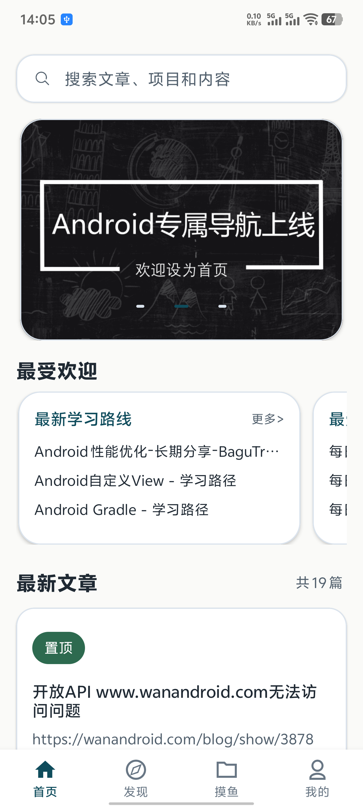</td>
    <td align="center"><strong>发现：体系、问答与导航</strong><br />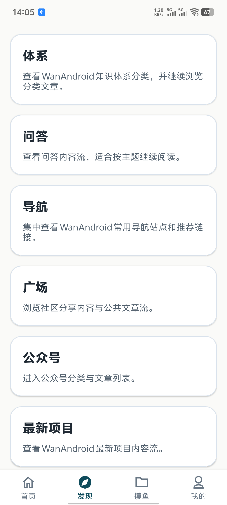</td>
  </tr>
  <tr>
    <td align="center"><strong>摸鱼内容入口</strong><br />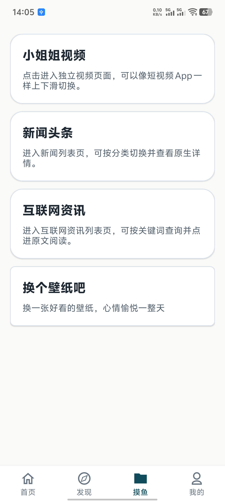</td>
    <td align="center"><strong>文章 WebView 详情</strong><br />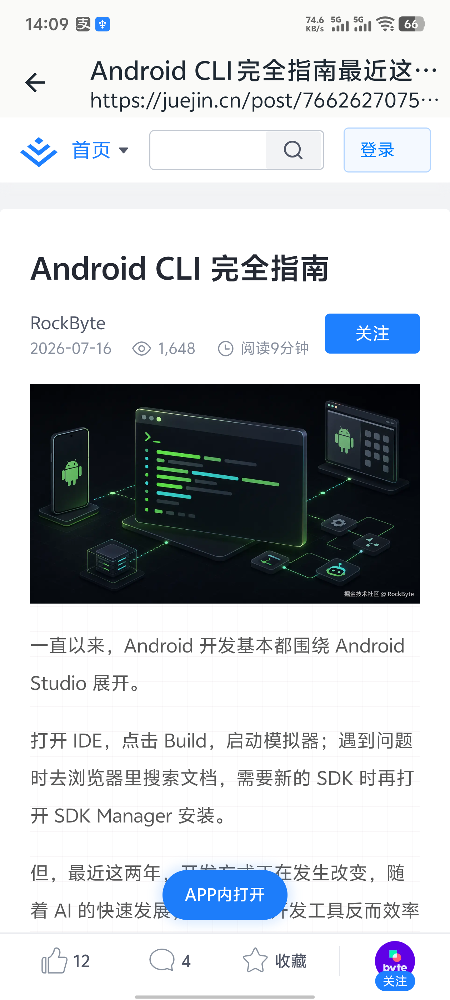</td>
  </tr>
  <tr>
    <td align="center"><strong>知识体系分类</strong><br />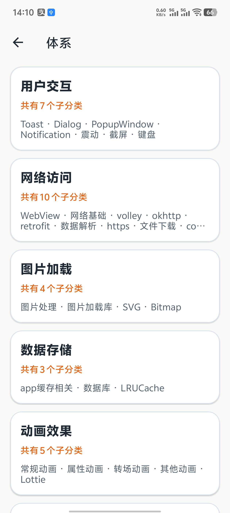</td>
    <td align="center"><strong>问答详情</strong><br />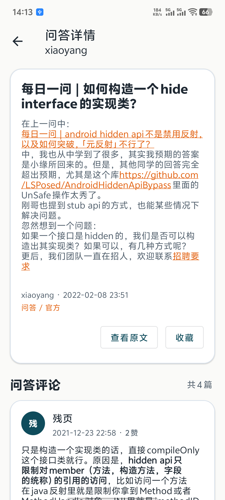</td>
  </tr>
  <tr>
    <td align="center"><strong>问答评论</strong><br />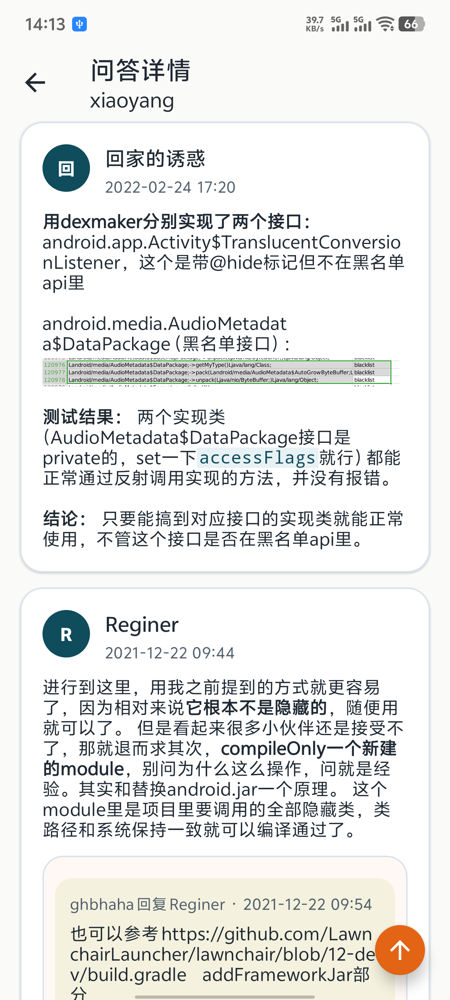</td>
    <td align="center"><strong>新闻头条</strong><br />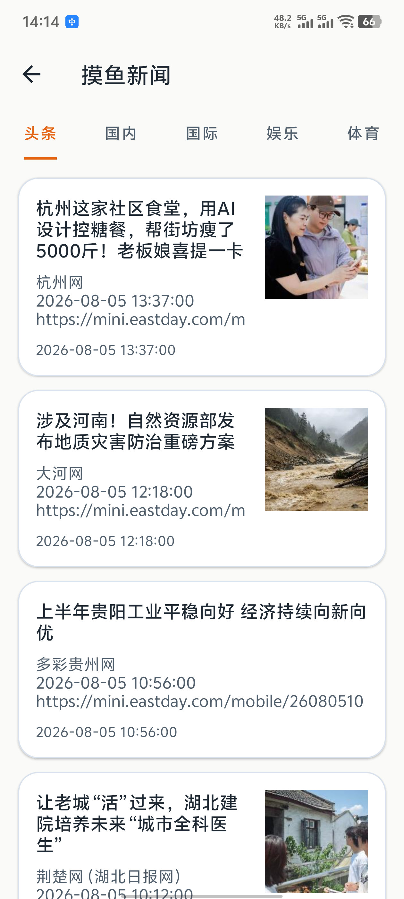</td>
  </tr>
  <tr>
    <td align="center"><strong>壁纸浏览与分类</strong><br />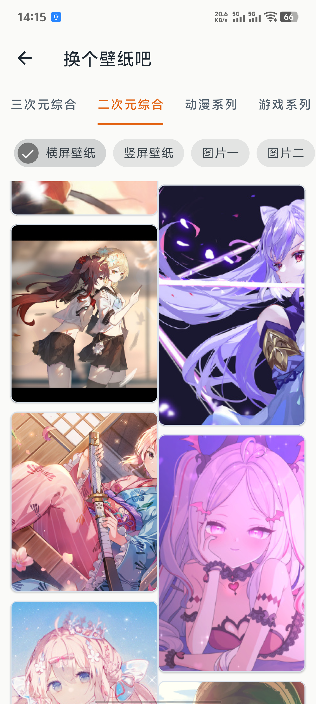</td>
    <td align="center"><strong>视频浏览</strong><br /></td>
  </tr>
  <tr>
    <td align="center"><strong>消息中心</strong><br />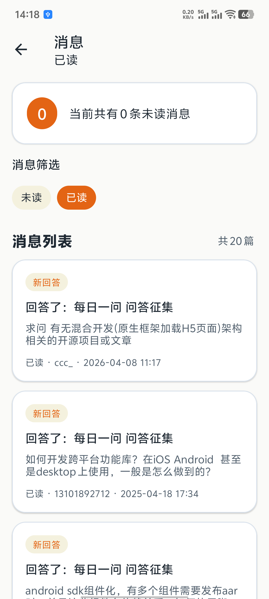</td>
    <td align="center"><strong>TODO 待办列表</strong><br />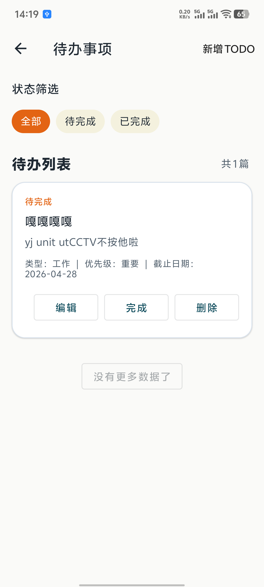</td>
  </tr>
  <tr>
    <td align="center"><strong>应用设置</strong><br />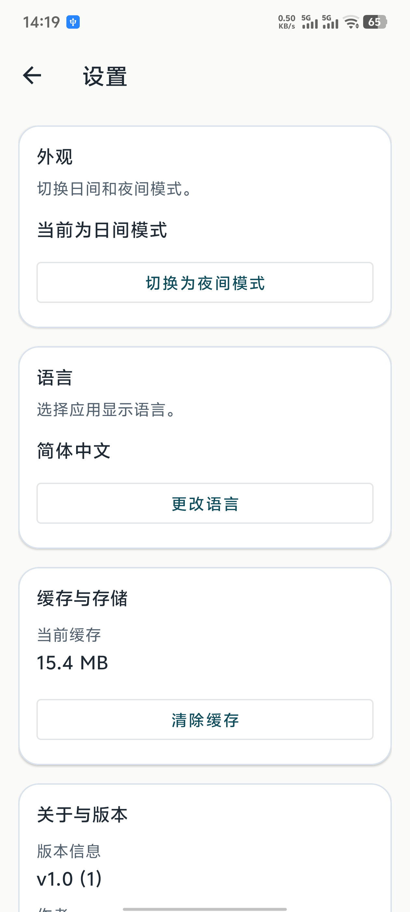</td>
    <td align="center"><strong>我的账户中心</strong><br />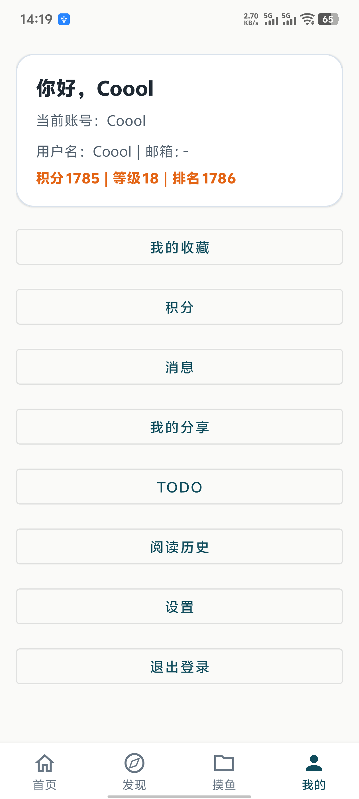</td>
  </tr>
</table>

## 功能

### 内容与发现

- 首页文章流：Banner、置顶文章、热词、常用网站、热门学习路线、问答和专栏
- 知识体系、导航分类及分类文章浏览
- 项目分类、项目文章和关键词搜索
- 问答、广场、公众号及最新项目内容
- 文章 WebView 浏览、阅读历史、搜索历史和常用站点

### 账户与个人能力

- 登录、注册、退出和 Cookie 会话保持
- 文章收藏/取消收藏、收藏列表和个人资料
- 积分概览与积分记录、已读/未读消息
- TODO 新建、编辑、删除、状态筛选和完成状态切换

### 扩展内容与体验

- 视频、新闻头条、互联网资讯和壁纸浏览/下载
- 下拉刷新、分页加载、骨架屏、回到顶部、空态与错误态
- 日/夜间模式、应用语言设置和缓存清理
- Markdown/HTML 富文本渲染

## 技术栈

| 类别 | 使用技术 |
| --- | --- |
| 语言与构建 | Kotlin、Gradle Kotlin DSL、Android Gradle Plugin、Gradle 9.3.1 |
| Android | `minSdk 24`、`targetSdk 36`、Android View/XML、Material Components |
| UI | RecyclerView、ConstraintLayout、SwipeRefreshLayout、Fragment、WebView |
| 架构 | MVVM、ViewModel、Repository、DTO/Domain Model/Ui Model、Mapper、UiState |
| 异步与状态 | Kotlin Coroutines、StateFlow |
| 网络 | Retrofit、OkHttp、Gson、OkHttp Logging Interceptor、多 Base URL 服务 |
| 本地能力 | SharedPreferences、Cookie 持久化、阅读/搜索历史、缓存与文件下载 |
| 内容展示 | Markwon（Markdown/HTML）、自定义远程图片加载 |
| 测试 | JUnit、Fake API Service、Repository 单元测试 |

## 架构

项目采用以功能为单位组织的 MVVM 结构，网络协议对象不会直接暴露给界面层：

```text
Activity / Fragment
        |
    ViewModel + UiState
        |
     Repository
        |
Remote API / Session / Local Storage
        |
DTO -- Mapper --> Domain Model / UI Model
```

- **UI 层：** 负责界面渲染与用户交互；`UiState` 显式表达初始加载、刷新、分页、空态和错误态。
- **Repository 层：** 编排数据请求、统一转换业务错误和网络异常，并处理不同接口的分页差异。
- **数据层：** Retrofit Service 定义接口，DTO 映射到领域模型；`PersistentCookieJar` 在 OkHttp 层统一管理登录 Cookie。
- **会话与设置：** 基于 `SharedPreferences` 持久化用户会话、应用设置及本地历史记录。

首页首屏通过 `coroutineScope + async` 并行请求 Banner、热词、常用网站、热门内容、置顶文章和文章列表，再按文章 ID 合并去重置顶与普通文章。

## 工程目录

```text
app/src/main/java/com/eric/wandroid/
├── common/        # 通用结果模型、UI 工具、缓存与下载
├── data/          # 网络服务、DTO、Repository、Mapper、会话与设置
├── domain/model/  # 面向业务的领域模型
└── ui/            # 按功能拆分的 Activity、Fragment、ViewModel、Adapter、UiState

agent/
├── docs/          # 项目规范、模块边界、接口规范、Agent 规则与工作流
└── tasks/         # 任务队列、状态看板、任务验收说明

api/               # 第三方接口说明与参考资料
design/             # 页面和组件设计素材
```

## 开始使用

### 环境要求

- Android Studio（建议使用稳定版）
- JDK 17 或更高版本
- Android SDK 36
- 可访问 Maven Central、Google Maven 及项目使用的公开数据接口的网络环境

### 构建与运行

1. 使用 Android Studio 打开项目根目录，等待 Gradle Sync 完成。
2. 选择 Android 7.0（API 24）及以上的模拟器或真机。
3. 运行 `app` 配置。

也可以在项目根目录执行：

```bash
# Windows
.\gradlew.bat assembleDebug

# macOS / Linux
./gradlew assembleDebug

# 单元测试
./gradlew testDebugUnitTest
```

构建产物默认位于 `app/build/outputs/apk/debug/`。

## 数据源与安全说明

- 核心内容、账户、收藏、积分、消息和 TODO 来自 WanAndroid 开放 API。
- 视频、壁纸、新闻及互联网资讯来自额外的第三方公开接口，属于扩展模块；接口限额、稳定性和内容版权以各服务提供方规则为准。
- 登录态依赖服务端 Cookie；请勿在 Issue、日志或截图中提交自己的 Cookie、账号和密码。

[//]: # (- 当前新闻相关 Repository 中存在用于开发联调的第三方接口 Key。**公开仓库、发布 APK 或正式环境使用前，应将其迁移到 `local.properties`、环境变量或服务端代理，禁止提交真实生产密钥。**)

## AI Agent 协作开发

项目不是将 AI 当作无约束的代码生成器，而是用文档与验收规则约束其参与开发。相关规范位于 [`agent/docs`](agent/docs)：

```text
需求确认
  -> 任务拆解
  -> 状态登记
  -> 实现
  -> 验证
  -> 文档回写
  -> 任务归档
```

- 每项功能对应明确的任务范围、依赖和验收标准，并由 `todo -> doing -> review -> done` 状态机跟踪。
- Agent 在实现前需读取项目范围、模块边界、API 规范和任务说明；完成后需回写状态、验证结果和遗留风险。
- 规则明确限制 UI 直接调用 API、ViewModel 直接依赖 Retrofit，以及页面层自行处理 Cookie 或接口分页差异。
- 小型修复和 UI 调整记入缺陷日志，保留问题、改动、验证方式和风险说明。

详细规则可见：[项目说明](agent/docs/PROJECT_SPEC.md)、[模块边界](agent/docs/MODULES.md)、[接口规范](agent/docs/API_SPEC.md)、[开发流程](agent/docs/WORKFLOW.md) 和 [Agent 规则](agent/docs/AI_RULES.md)。
